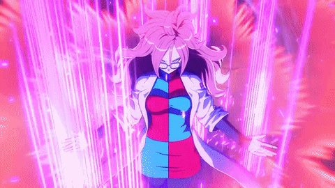

[](https://git.io/typing-svg)
<picture>
  <source
    srcset="./ressources/lucy3.gif"
    media="(prefers-color-scheme: dark)"
    width="100%"
  />
</picture>
 

<div style="display: flex; align-items: center;">

  ```ruby
  class NaryaAI
    attr_accessor :name, :love, :country, :statue

    def initialize
      @name = "Narya"
      @statue = "Netrunner"
      @love = ["EVE from Stellar Blade", "Anime", "Manga", "Gaming", "AI" , "Girls", "Cyberpunk"]
      @country = "France"
    end
    def to_s
      "Name: #{@name}\nStatue: #{@statue}\nLoves: #{@love.join(', ')}\nCountry: #{@country}"
      end
  end

  Narya = NaryaAI.new
  puts Narya 
  ```

</div> 

## Skills


### Languages:
<div align="center">
  <a href="https://skillicons.dev/icons?i=js,rust,c,py,ruby">
    
  </a>
</div>

### Tools:
<div align="center">
  <a href="https://skillicons.dev/icons?i=blender,discord,github,neovim,vscode,unreal,powershell,pycharm,rider,clion,ubuntu">
    
  </a>
</div>
